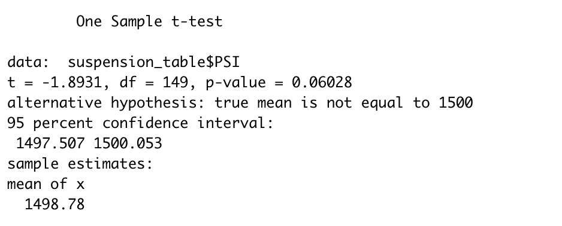
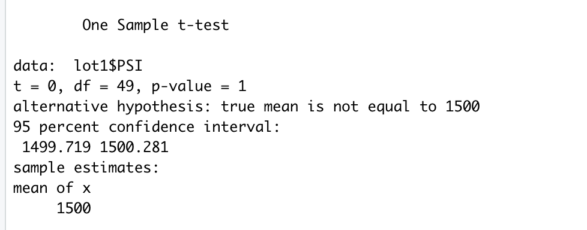
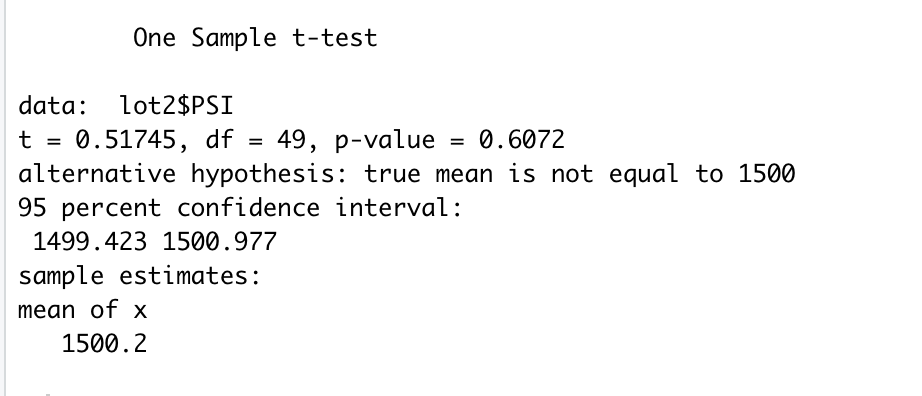
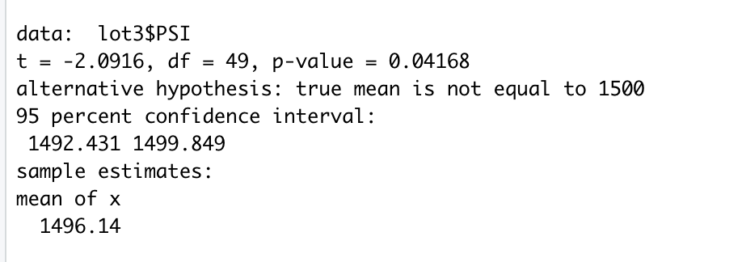

# MechaCar_Statistical_Analysis

## Linear Regression to Predict MPG

* Intercept, vehicle_length and ground_clearance are statistically unlikely to provide random amounts of variance to the linear model. Each of their probability values are lower than our significance level of .05.  In other words, vehicle_length and ground_clearance have a significant impact on MPG. 
* The slope of this regression is not 0 because there is a significance between our dependent and independent variables. 
* This linear regression model tells us there is a relationship between a few of the metrics for cars (vehicle_length and ground_clearance) and mpg. This tells how our independent variables account for variability in our depdent variable. However, this does not predict the mpg of the MechaChar protoypes. The lack of significant variables is evidence of overfitting. 
* Overfitting means the model performs well with the current dataset, but may fail to generalize and predict future data correctly.

## Summary Statistics on Suspension Coils

### Total Summary Statistics for All Lots 

### Summary Statistics for Each Lot 

The design specifications for the MechaCar requires the variance of suspension coils to not exceed 100 pounds per square inch. Our Lot Summary shows that one lot has failed. Lot3 has a variance of 170.29. By simply looking at the overall summary statistics, our variance  for PSI is 62.29. If we had not calculated the summary statistics for each lot, in addition to all lots we would have failed to noticed Lot3 is not in compliance. This could become a great safety issue for customers & drivers of vehicles of Lot3. 

## T-Tests on Suspension Coils

Another way to test if the PSI for each manufacturing lot is statstically different from the population mean of 1,500 pounds per square inch (PSI) is by performing a t-Test. I performed 4 t-Tests to compare all manufacturing lots and each individual lot to the population mean for PSI. Each t-Test had a similar null and alternative hypothesis. The null and alternative hypothesis are as follows:

H0: There is no statistical difference between the observed sample mean and its population mean 
Ha: There is a statistical difference between the observed sample mean and its population mean

The results are as follows:
#### Across All Manufacturing Lots 

Across all manufacturer lots, the p-value is not less than the significance level of .05. There is not sufficient statistical evidence to reject the null hypothesis. There is enough statistic evidence to state the mean PSI across all manufacturing lots equal to the population mean. 

#### Lot 1 

For Lot 1, the p-value is not less than the significance level of .05. There is not sufficient statistical evidence to reject the null hypothesis. There is enough statistic evidence to state the mean PSI across Lot 1 is equal to the population mean. 

#### Lot 2 

For Lot 2, the p-value is not less than the significance level of .05. There is not sufficient statistical evidence to reject the null hypothesis. There is enough statistic evidence to state the mean PSI across Lot 2 is equal to the population mean. 

#### Lot 3 

Lot 3 has a p-value of .04, which is less than the signifiance level of .05. There is sufficient statistical evidence to reject the null hypothesis. The mean of PSI for Lot 3 is not equal to the population mean. 

