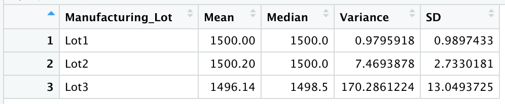

# MechaCar_Statistical_Analysis

## Linear Regression to Predict MPG

* Intercept, vehicle_length and ground_clearance are statistically unlikely to provide random amounts of variance to the linear model. Each of their probability values are lower than our significance level of .05.  In other words, vehicle_length and ground_clearance have a significant impact on MPG. 
* The slope of this regression is not 0 because there is a significance between our dependent and independent variables. 
* This linear regression model tells us there is a relationship between a few of the metrics for cars (vehicle_length and ground_clearance) and mpg. This tells how our independent variables account for variability in our depdent variable. However, this does not predict the mpg of the MechaChar protoypes. The lack of significant variables is evidence of overfitting. 
* Overfitting means the model performs well with the current dataset, but may fail to generalize and predict future data correctly.

## Summary Statistics on Suspension Coils

### Total Summary Statistics for All Lots 

### Summary Statistics for Each Lot 

By looking at the overall summary and the summary for each lot we can see differences between each lot and the overall summary statistics. Most importantly, if the design specifications for the MechaCar requires the variance of suspension coils to not exceed 100 pounds per square inch, our Lot Summary shows that one lot has failed. Lot 3 has a variance of 170.29. By simply looking at the overall summary statistics, our variance is 62.29. If we had not calculated the summary statistics for each lot, in addition to all lots we would have failed to noticed Lot3 is not in compliance. This could become a great safety issue for customers & drivers of vehicles of Lot3. 

